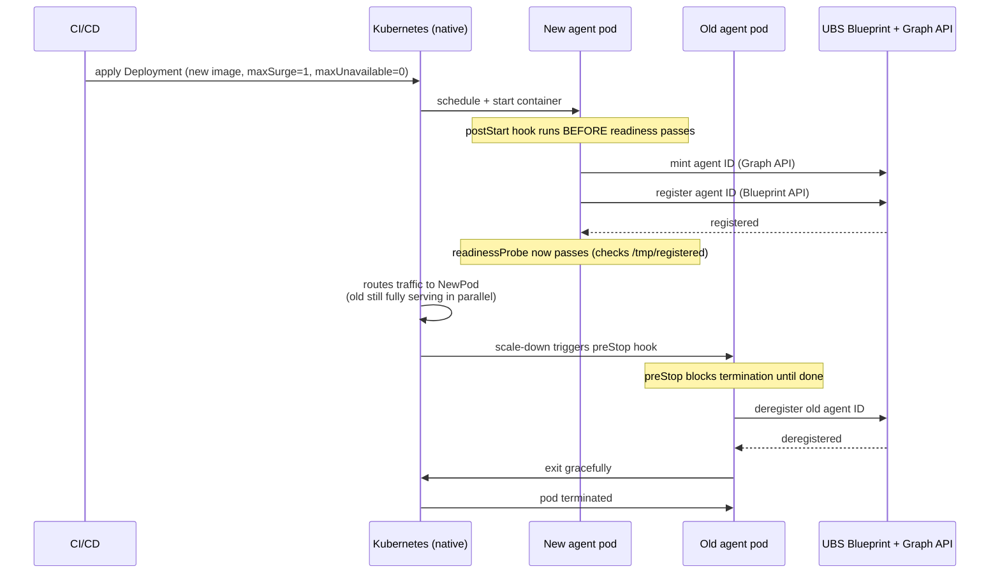
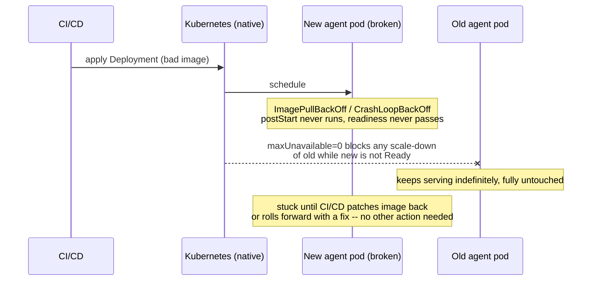
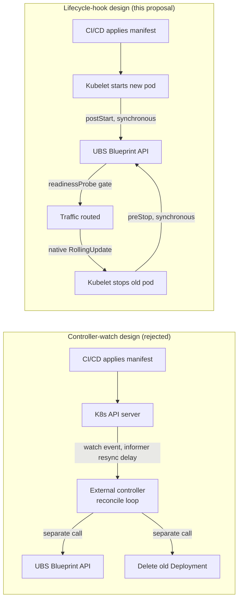

# Architecture diagram (Mermaid)

## Sequence: version transition, end to end

```mermaid
sequenceDiagram
    participant CICD as CI/CD
    participant K8s as Kubernetes (native)
    participant NewPod as New agent pod
    participant OldPod as Old agent pod
    participant UBS as UBS Blueprint + Graph API

    CICD->>K8s: apply Deployment (new image, maxSurge=1, maxUnavailable=0)
    K8s->>NewPod: schedule + start container
    Note over NewPod: postStart hook runs BEFORE readiness passes
    NewPod->>UBS: mint agent ID (Graph API)
    NewPod->>UBS: register agent ID (Blueprint API)
    UBS-->>NewPod: registered
    Note over NewPod: readinessProbe now passes (checks /tmp/registered)
    K8s->>K8s: routes traffic to NewPod<br/>(old still fully serving in parallel)
    K8s->>OldPod: scale-down triggers preStop hook
    Note over OldPod: preStop blocks termination until done
    OldPod->>UBS: deregister old agent ID
    UBS-->>OldPod: deregistered
    OldPod->>K8s: exit gracefully
    K8s->>OldPod: pod terminated
```

## Failure path: broken new version never disrupts old

```mermaid
sequenceDiagram
    participant CICD as CI/CD
    participant K8s as Kubernetes (native)
    participant NewPod as New agent pod (broken)
    participant OldPod as Old agent pod

    CICD->>K8s: apply Deployment (bad image)
    K8s->>NewPod: schedule
    Note over NewPod: ImagePullBackOff / CrashLoopBackOff<br/>postStart never runs, readiness never passes
    K8s--xOldPod: maxUnavailable=0 blocks any scale-down<br/>of old while new is not Ready
    Note over OldPod: keeps serving indefinitely, fully untouched
    Note over NewPod: stuck until CI/CD patches image back<br/>or rolls forward with a fix -- no other action needed
```

## Why no external controller

```mermaid
flowchart LR
    subgraph Old["Controller-watch design (rejected)"]
        direction TB
        A1["CI/CD applies manifest"] --> A2["K8s API server"]
        A2 -->|watch event, informer resync delay| A3["External controller<br/>reconcile loop"]
        A3 -->|separate call| A4["UBS Blueprint API"]
        A3 -->|separate call| A5["Delete old Deployment"]
    end

    subgraph New["Lifecycle-hook design (this proposal)"]
        direction TB
        B1["CI/CD applies manifest"] --> B2["Kubelet starts new pod"]
        B2 -->|postStart, synchronous| B3["UBS Blueprint API"]
        B3 -->|readinessProbe gate| B4["Traffic routed"]
        B4 -->|native RollingUpdate| B5["Kubelet stops old pod"]
        B5 -->|preStop, synchronous| B3
    end
```
