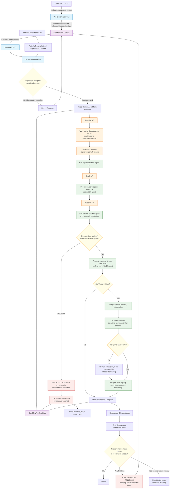

# UBS Agent Deployment — Final Architecture (Detailed Flow)

Our proposed architecture (POC v2 native self-registering mechanism +
durable orchestration, no CRD, no idempotency store, automatic rollback),
drawn in a detailed end-to-end flow.



## Legend

- **Blue (control plane):** Deployment Gateway, cell worker pool, workflow —
  the durable orchestration layer.
- **Orange (external / cluster):** Blueprint API, Graph API, UK8s, and the
  native Deployment/pod actions.
- **Green (native mechanism):** the POC v2 core — pod self-mints,
  self-registers, self-deregisters; cutover driven by `maxUnavailable: 0`.
- **Red (rollback):** automatic pre-promotion rollback, and guarded
  post-promotion rollback.
- **Purple (state):** durable workflow state, event queue.
- **Yellow (decisions):** lock acquisition, health, old-version existence,
  deregister success, post-promotion breach.

## How this maps to the reference structure you liked

| Reference diagram node | Our architecture equivalent |
|---|---|
| Agent Lifecycle Gateway | Deployment Gateway |
| Event Queue / Broker → partition by Blueprint | Same, partition by Blueprint ID |
| Go Worker Pool / Reconciler | Cell Worker Pool + Deployment Workflow |
| Acquire Blueprint Lock | Per-Blueprint serialization lock |
| Generate Agent ID → Graph API | Done **inside the pod** (supervisor), not by the worker |
| Deploy New Agent / Wait for Deployment | Apply native Deployment + `maxUnavailable: 0` |
| New Version Healthy? | Readiness gate + health gates |
| Keep Existing Version (on fail) | **Automatic rollback** (old was never touched) |
| Promote / Delete Old | Native rollout retires old; pod self-deregisters |
| Periodic Reconciliation | Reconciliation + orphaned-Agent-ID detection sweep |

The two meaningful differences from the reference (both deliberate, both
core to our design): Agent ID minting/registration happens **inside the
pod** rather than in the worker, and the "keep existing version" branch is
an **automatic rollback** rather than a human-gated wait.
```