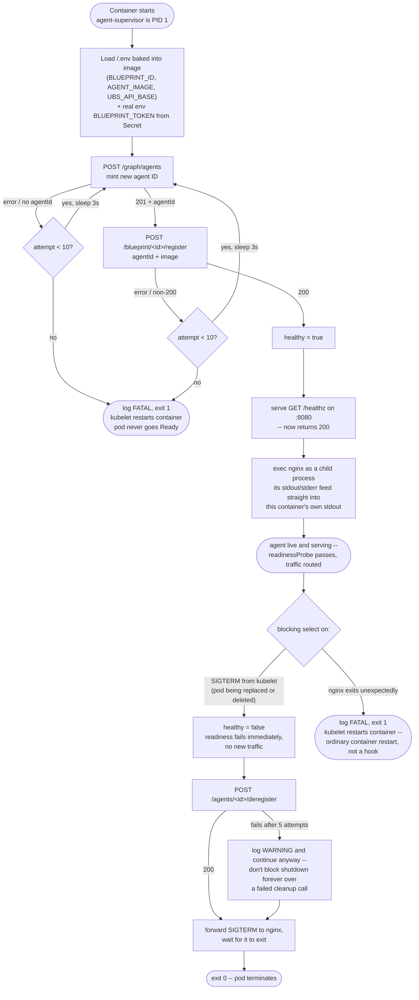
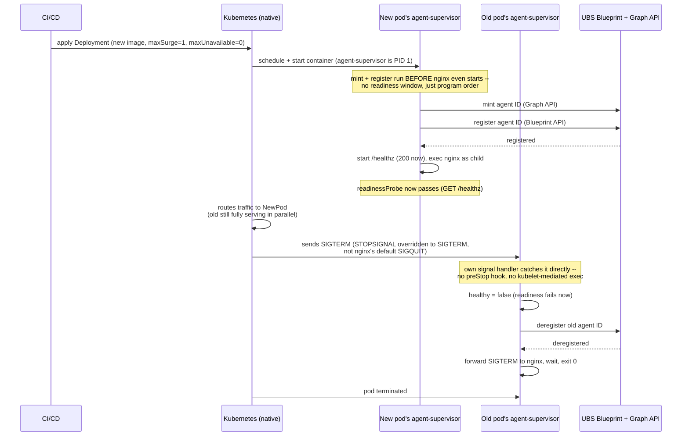
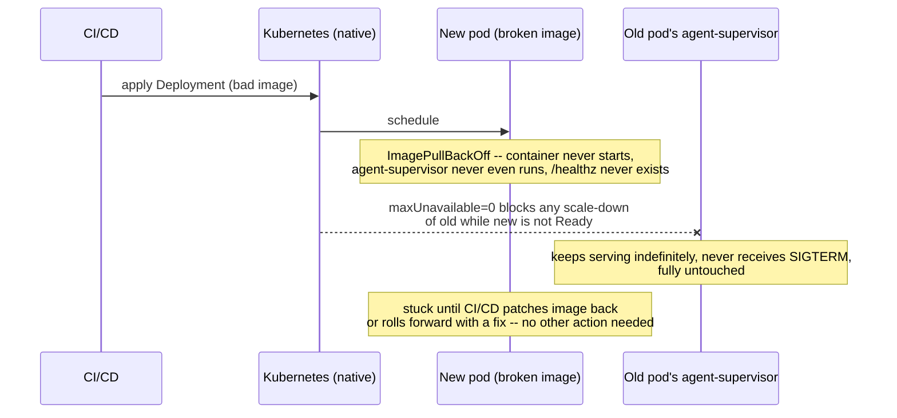
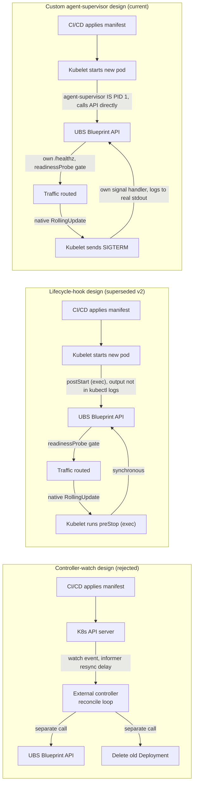

# Architecture diagram (Mermaid)

## Full lifecycle flow, styled end-to-end

The same shape of diagram you'd draw for a controller-based system --
deploy event in, decision diamonds, retry loops, color-coded by
component -- but mapped onto what v2 actually contains. The dashed box at
the bottom lists what a queue/worker-pool/lock design would need that this
one doesn't, and why: there's exactly one writer per blueprint (Kubernetes'
own Deployment object), so there's nothing left to coordinate.

```mermaid
flowchart TD
    A["Developer / CI-CD"] -->|"kubectl apply / patch image"| B["Kubernetes Deployment<br/>RollingUpdate maxSurge=1, maxUnavailable=0"]

    B --> C["New pod scheduled --<br/>agent-supervisor starts as PID 1"]

    C --> D["Load identity: baked-in /.env<br/>(BLUEPRINT_ID, AGENT_IMAGE, UBS_API_BASE)<br/>+ BLUEPRINT_TOKEN from Secret"]

    D --> E["Graph API: mint new Agent ID"]

    E --> F{"Mint succeeded?"}
    F -->|"no, retry"| G["sleep 3s<br/>(in-process, up to 10x)"]
    G --> E
    F -->|"no, retries exhausted"| H(["log FATAL, exit 1 --<br/>kubelet restarts container,<br/>pod never goes Ready"])

    F -->|yes| I["Blueprint API: register<br/>agentId + image"]

    I --> J{"Register succeeded?"}
    J -->|"no, retry"| G
    J -->|"no, retries exhausted"| H
    J -->|yes| K["healthy = true --<br/>serve GET /healthz on :8080"]

    K --> L["exec nginx as child process --<br/>its stdout/stderr feed this<br/>container's own real stdout"]

    L --> M["Kubernetes readinessProbe:<br/>GET /healthz"]

    M --> N{"Ready?"}
    N -->|not yet| M
    N -->|yes| O["Traffic routed to new pod --<br/>old pod still fully serving in parallel"]

    O --> P["Kubernetes sends SIGTERM to OLD pod<br/>(STOPSIGNAL overridden to SIGTERM --<br/>nginx's own default SIGQUIT would<br/>never reach agent-supervisor's handler)"]

    P --> Q["Old pod: healthy = false immediately --<br/>readinessProbe fails, no new traffic"]

    Q --> R["Blueprint API: deregister old Agent ID"]

    R --> S{"Deregister succeeded?"}
    S -->|"no, after 5 attempts"| T["log WARNING, continue anyway --<br/>never block shutdown indefinitely"]
    T --> U
    S -->|yes| U["forward SIGTERM to nginx,<br/>wait for exit, then exit 0"]

    U --> V(["Kubernetes removes old pod --<br/>exactly one version now running"])

    B -.->|"bad image tag"| W["New pod: ImagePullBackOff --<br/>agent-supervisor never even starts"]
    W -.-> X["maxUnavailable=0 blocks any scale-down<br/>of old pod -- native Kubernetes,<br/>no code of ours involved"]
    X -.-> Y(["Old pod keeps serving indefinitely,<br/>never receives SIGTERM"])

    subgraph Absent["What a queue/worker-pool/lock design would need -- and why this doesn't"]
        direction LR
        Z1["Event Queue / Broker"]
        Z2["Go Worker Pool"]
        Z3["Acquire Blueprint Lock"]
        Z4["Periodic Reconciliation"]
        Z5["Controller Crash Recovery"]
        Z6["-- all replaced by: one Deployment object<br/>per blueprint is Kubernetes' own single<br/>writer, and there's no separate controller<br/>process that can crash or lose events"]
        Z1 -.-> Z6
        Z2 -.-> Z6
        Z3 -.-> Z6
        Z4 -.-> Z6
        Z5 -.-> Z6
    end

    classDef supervisor fill:#e1f5fe,stroke:#0277bd
    classDef external fill:#fff3e0,stroke:#ef6c00
    classDef state fill:#f3e5f5,stroke:#7b1fa2
    classDef decision fill:#fffde7,stroke:#f9a825
    classDef absent fill:#fafafa,stroke:#9e9e9e,stroke-dasharray: 4 3

    class C,K,L,Q,U supervisor
    class B,E,I,M,O,P,R,V,W,X,Y external
    class D state
    class F,J,N,S decision
    class Z1,Z2,Z3,Z4,Z5,Z6 absent
```

## agent-supervisor internal flow (this is the whole design)

Everything the agent does — register, serve, deregister — happens inside
this one process, which is the container's actual PID 1. There is no
Kubernetes lifecycle hook and no controller anywhere in this diagram.

## Sequence: version transition, end to end

## Failure path: broken new version never disrupts old

## Why no external controller, and no lifecycle hooks either

