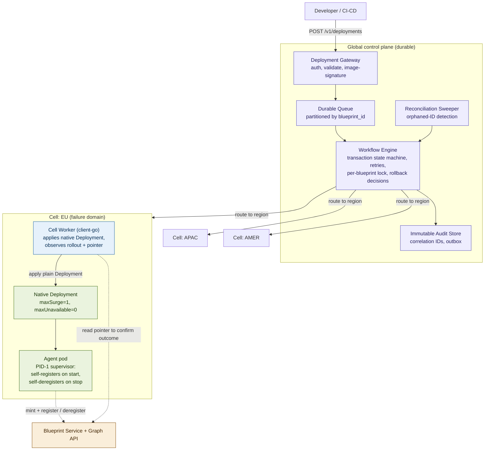
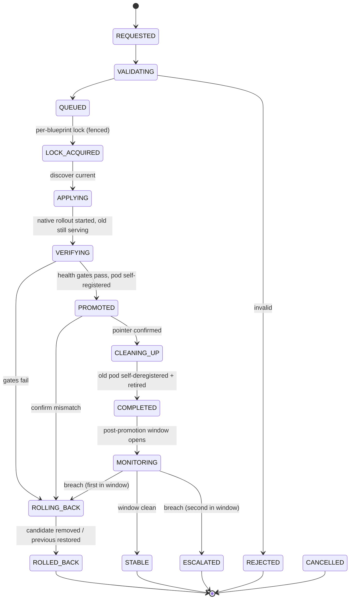

# UBS AI Agent Deployment Platform — Production Architecture Specification

**Native Self-Registering Execution + Durable Global Orchestration (No CRD)**

| Field | Value |
|---|---|
| Document status | Production architecture specification |
| Design family | POC v2 in-pod mechanism + durable orchestration control plane |
| Deliberately excluded | Custom Resource Definitions; in-cluster reconciliation controller; heavyweight distributed idempotency ledger |
| Primary safety invariant | Never remove a healthy production version for an unproven candidate |
| Failure principle | A failed candidate rolls back automatically; the last known-good version is never disrupted |
| Target scale | Multi-namespace, multi-blueprint, multi-cluster, multi-region |
| Revision | 1.0 |

---

## Contents

1. Executive summary
2. Scope, assumptions & non-goals
3. Architectural principles & invariants
4. Logical architecture
5. Component responsibilities & contracts
6. Deployment lifecycle
7. Deployment state machine
8. Data model
9. Idempotency model
10. Concurrency model
11. Failure matrix
12. Multi-region strategy
13. Security model
14. Observability
15. Audit & forensics
16. Disaster recovery & business continuity
17. Service level objectives
18. Technology decision matrix vs. alternatives
19. Open decisions

---

## 1. Executive summary

The platform replaces the currently promoted version of a logical AI agent
with a newly allocated Agent ID, without removing the healthy version before
the candidate is verified. It must remain safe when requests are duplicated,
APIs time out, workers crash, Kubernetes is briefly unavailable, promotion
succeeds but cleanup fails, or a candidate degrades after promotion.

The architecture combines two layers that each own what they are best at:

- A **native, self-registering in-pod execution mechanism.** Every agent is
  a plain Kubernetes `Deployment`. A supervisor process running as PID 1 in
  each pod mints an Agent ID and registers it against the blueprint *before*
  the pod is allowed to serve traffic, and deregisters it on shutdown. The
  guarantee that the old version is never removed until the new one is
  healthy is provided by Kubernetes' own `RollingUpdate` with
  `maxUnavailable: 0` — not by platform code.

- A **durable global orchestration control plane.** A gateway accepts and
  validates deployment requests; a partitioned durable queue and a durable
  workflow engine own the deployment transaction, per-blueprint
  serialization, rollback decisions, and audit; regional cells isolate
  failure domains.

Two things are deliberately absent. There is **no CRD and no custom
in-cluster controller** — a plain `Deployment` is the only Kubernetes object,
so developers learn nothing new and there is no bespoke controller to keep
alive. There is **no heavyweight idempotency ledger** — correctness on the
common path is provided by Kubernetes' declarative apply semantics and
per-blueprint serialization, and the single residual gap (an orphaned Agent
ID if a pod dies mid-registration) is handled by a detection sweep rather
than a prevention layer. Section 9 states this posture honestly and precisely.

The design's most important property is the separation of authority: Git
declares source, CI/CD submits intent, the workflow engine owns the durable
transaction, the Blueprint Service owns the logical "current agent" pointer,
the Graph API owns identity allocation, Kubernetes owns scheduling and
rollout, and the pod's own supervisor owns its registration. No layer takes a
destructive action while the authoritative state is uncertain.

---

## 2. Scope, assumptions & non-goals

### 2.1 Operating model (from source requirements)

A namespace contains multiple blueprints; a blueprint represents one logical
agent; each version of that agent receives a distinct Agent ID from the Graph
API; only one version is promoted at a time. The Blueprint token is a
credential for an internal UBS control-plane service. Deployments are
triggered by CI/CD (or manual) manifest change.

### 2.2 Assumptions to validate (`[CONFIRM]`)

The Blueprint Service exposes read, register, and deregister operations over
plain REST; whether it supports compare-and-set / ETag is unconfirmed and
treated as optional (Section 10). The Graph API allocates IDs; whether it
supports an idempotency key or lookup-by-reference is unconfirmed and, if
present, would strengthen Section 9. Register and deregister are separate
calls with no combined transaction.

### 2.3 Non-goals

Replacing Kubernetes as the scheduler; redefining the Blueprint or Graph API
internals; building a new global secret manager; providing generic CD for all
UBS workloads; guaranteeing exactly-once network delivery. The platform
targets idempotent business *outcomes* under at-least-once execution for the
common path, with one explicitly documented residual gap.

---

## 3. Architectural principles & invariants

### 3.1 Safety invariants (must always hold)

1. The old version's pods are never scaled below full capacity until a new
   pod is `Ready`. (Native `maxUnavailable: 0`.)
2. A pod never reports `Ready` until it has successfully registered its Agent
   ID. (Readiness probe tied to the registration marker.)
3. At most one deployment workflow mutates a given blueprint at a time.
   (Per-blueprint serialization lock.)
4. Promotion and cleanup are distinct; a cleanup failure never reverts a
   successful promotion.
5. A failed candidate never becomes production; it triggers automatic
   rollback.
6. No single deployment failure can fail the global control plane.

### 3.2 Design principles

One authority per boundary. Explicit state machine over state hidden in
annotations. Per-blueprint serialization with global parallelism.
Cell-based failure isolation. Least privilege and workload identity.
Kubernetes-native mechanism preferred over bespoke control logic.
Observability and audit as first-class features. Automatic rollback with a
human involved only to break a rollback flap.

---

## 4. Logical architecture



The system has three tiers. The **global control plane** is durable and owns
the deployment transaction, rollback policy, and audit. **Regional cells**
are independent failure domains that execute the transaction against a
region's clusters. The **in-pod mechanism** is the native, self-registering
core: the pod does its own registration, and Kubernetes performs the cutover.

The load-bearing structural choice is that **the pod registers itself** — the
control plane never reaches into the cluster to mutate Blueprint state or hold
agent credentials. The cell worker applies a plain `Deployment` and then
*reads* the Blueprint pointer to confirm the outcome the pod produced.

---

## 5. Component responsibilities & contracts

| Component | Owns | Must not own |
|---|---|---|
| CI/CD | Build, sign, submit a deployment request | Direct deletion of a production agent |
| Deployment Gateway | Auth, schema/signature validation, request intake, routing | Kubernetes lifecycle; long-lived workflow state |
| Durable Queue | Partitioned, backpressured, durable handoff (key = blueprint_id) | Business source of truth |
| Workflow Engine | Deployment transaction state, retries, timers, per-blueprint serialization, rollback decisions | Pod scheduling; agent registration |
| Cell Worker | Apply the native Deployment; observe rollout + pointer; execute rollback | Global ordering; holding agent tokens |
| Native Deployment + Kubernetes | Scheduling, the rolling-update cutover, keeping old alive until new is Ready | Agent identity allocation; audit |
| Agent pod supervisor (PID 1) | Mint + register on start; deregister on stop; supervise workload; serve `/healthz` | Any cross-deployment orchestration |
| Blueprint Service | Authoritative "current agent" pointer | Kubernetes state |
| Graph API | Allocate Agent IDs | Deployment lifecycle / promotion decisions |
| Audit Store | Immutable transition events | Being used as a live workflow lock |
| Reconciliation Sweeper | Detect orphaned IDs and drift | Runtime reconciliation of healthy workloads |

---

## 6. Deployment lifecycle

1. **Request.** CI/CD submits `blueprint_id`, `logical_agent_id`,
   `source_revision`, `image_digest`, `target_environment`, `target_cell`.
   The gateway validates and assigns a `deployment_id` (correlation ID).
2. **Route & serialize.** The request is queued (partitioned by blueprint)
   and routed to the target cell, where it waits behind any active
   transaction for the same blueprint.
3. **Apply.** The cell worker applies a plain native `Deployment` with the new
   image. Because the object name is deterministic, this is a declarative
   update; Kubernetes begins a `RollingUpdate`. The old pod keeps serving in
   full (`maxUnavailable: 0`).
4. **Self-register.** The new pod's supervisor mints a fresh Agent ID (Graph
   API), registers it against the blueprint (Blueprint API), and only then
   passes its readiness gate. Until then it receives no traffic and the old
   pod is not retired.
5. **Verify.** The worker observes rollout status and configured health gates
   (readiness stable, dependencies reachable, smoke test / error-rate window
   for the production tier).
6. **Promote & confirm.** On success, the worker reads the Blueprint pointer
   to confirm the new Agent ID is current — confirming the outcome the pod
   produced rather than performing the promotion itself.
7. **Retire old.** As Kubernetes scales the old pod down (only after the new
   pod is Ready), the old pod's supervisor catches termination, deregisters
   its own Agent ID, and exits.
8. **Complete.** The worker records `COMPLETED`, releases the lock, and emits
   an audit event. Exactly one version now runs.
9. **Monitor.** For a defined window after promotion, the worker watches for
   post-promotion regression (Section 12 rollback policy).

**Failed-candidate path:** if the candidate never becomes healthy, the old
version — which was never touched — keeps serving, and the transaction
**automatically rolls back** by removing the broken candidate. There is
nothing to restore.

---

## 7. Deployment state machine

Every transition writes an audit event and persists the new state to the
durable workflow record *before* the next side effect. On worker restart, the
workflow resumes by re-entering the persisted state and re-reading real
system state (Blueprint pointer + Kubernetes) rather than assuming the last
action's outcome.



| State | Safety meaning |
|---|---|
| REQUESTED / VALIDATING | No runtime side effect yet |
| QUEUED / LOCK_ACQUIRED | No workload mutation until serialized |
| APPLYING / VERIFYING | Old production remains authoritative and serving |
| PROMOTED | Business identity has moved (the pod did this) |
| CLEANING_UP | Cleanup cannot undo promotion |
| COMPLETED / MONITORING / STABLE | Exactly one version; watching for regression |
| ROLLING_BACK / ROLLED_BACK | Automatic recovery; last known-good preserved |
| ESCALATED | Rollback flap; human breaks the loop |

---

## 8. Data model

### 8.1 DeploymentRequest (durable, authoritative)

`deployment_id` (PK), `blueprint_id` (index), `logical_agent_id`,
`source_revision`, `image_digest`, `target_environment`, `cell_id`,
`requested_by`, `candidate_agent_id` (filled from the Blueprint read after the
pod registers — not minted here), `current_agent_id_at_discovery`, `state`,
`fencing_token`, `created_at` / `started_at` / `completed_at`.

### 8.2 WorkflowRun

Owned by the workflow engine's native history; links to `deployment_id`;
holds retry counts, timers, current activity.

### 8.3 AuditEvent (append-only, immutable)

`event_id` (PK, put-if-absent), `deployment_id` (index), `blueprint_id`,
`timestamp`, `actor`, `from_state`, `to_state`, `external_refs`
(`{agent_id, generation, k8s_revision}`), `policy_decision`, `result_code`.
Written through a durable outbox so audit survives a brief store outage.

### 8.4 Deliberately not stored

No idempotency ledger keyed by `deployment_id`. No in-platform mirror of
Kubernetes state (pods/labels are read live). No agent tokens in any platform
store — they exist only as per-blueprint Kubernetes Secrets consumed by pods.

---

## 9. Idempotency model

This design does not carry a heavyweight idempotency ledger. Its idempotency
posture is composed from native properties plus one honestly-stated residual
gap.

| Operation | How idempotency is achieved | Residual risk |
|---|---|---|
| Apply Deployment | Kubernetes declarative apply is name-keyed — re-applying the same named Deployment is an update, never a duplicate | None |
| Concurrent requests, same blueprint | Per-blueprint serialization (Section 10) prevents concurrent conflicting mutation | None |
| Duplicate deployment request | The second transaction, once serialized, observes the desired image already deployed and no-ops | None (a duplicate *record* may exist; the *outcome* is safe) |
| Deregister old agent | Idempotent by contract — NotFound is treated as success | None |
| Health check | Read-only, repeatable | None |
| **Mint + register (in pod)** | Register overwrites the pointer to the new ID; serialization ensures a single writer | **Orphaned Agent ID on crash — see below** |

**The one residual gap, stated plainly.** If a pod's supervisor mints an
Agent ID from the Graph API and is killed before it registers or records that
ID, the restarted pod mints a *second* ID; the first is never registered or
deregistered and becomes an orphaned allocation. This does not corrupt the
running system — the agent that ends up serving is always correct — but it is
a slow identity leak. This design **detects** rather than **prevents** it,
via the reconciliation sweep (Section 11 failure matrix and the sweeper
component): a periodic job lists registered IDs against live, ready pods and
flags any registered ID with no corresponding healthy pod, or any
minted-but-unregistered ID beyond a TTL, for alerting and optional
reclamation. Consequently, *orphaned-ID detection latency is itself an SLO*
(Section 17) — the platform commits to finding orphans within a bounded
window rather than preventing them.

**How to close the gap if upstream allows.** If the Graph API supports an
idempotency key or lookup-by-`deployment_id` (`[CONFIRM]`), the supervisor
passes it so a retry returns the same ID, eliminating the gap entirely and
downgrading the sweep to a belt-and-suspenders check. This is the single
highest-value upstream capability to confirm.

---

## 10. Concurrency model

Concurrency is controlled at **blueprint granularity** through serialization,
not through compare-and-swap.

- **Lock key** is `blueprint:{blueprint_id}` — not namespace, not cluster.
  Different blueprints deploy fully in parallel; versions of the same
  blueprint are serialized.
- **Lock requirements:** durable and recoverable after worker loss; carries
  an owner identity and a monotonic **fencing token**; safe release after
  restart; lease expiry must not let an old owner keep mutating; supports
  observable wait state; is **not held during human waits** (an `ESCALATED`
  workflow releases execution capacity while preserving state).
- **Why serialization suffices.** One `Deployment` per agent plus
  `maxUnavailable: 0` means Kubernetes is already the single writer for the
  pod-level cutover; the lock only prevents two *workflows* from racing to
  apply conflicting desired state.
- **Honest limitation — no CAS backstop.** The heavyweight-spec alternative
  promoted the pointer with compare-and-swap, so a stale write would be
  rejected even if serialization failed. This design removed that layer, so
  **lock correctness is load-bearing**: the single-writer guarantee is only
  as strong as the fenced lock. If the Blueprint Service can reject writes
  carrying a stale fencing token (`[CONFIRM]`), that restores a backstop
  cheaply; otherwise the lock stands alone and must be implemented and tested
  with corresponding care.

---

## 11. Failure matrix

| Failure | Immediate effect | Safety invariant | Recovery |
|---|---|---|---|
| Gateway unavailable | No new requests accepted | Production unaffected | HA replicas; client retry (apply is idempotent, no dedup needed) |
| Worker crash mid-transaction | Transaction pauses | Production unchanged | Durable workflow resumes; re-reads Blueprint + Kubernetes |
| Graph mint timeout | New pod can't register, stays not-Ready | Old serving (`maxUnavailable:0`) | Supervisor retries; if exhausted, pod crash-loops, old keeps serving |
| Register fails | Pod stays not-Ready | Old serving | Supervisor retries whole loop |
| Candidate never Ready / bad image | Candidate never healthy | Old untouched | Automatic pre-promotion rollback |
| Confirm-promotion mismatch | Pointer ≠ expected | Correct current preserved | Rollback; treat as superseded |
| Deregister-old fails | Old + new briefly both registered | New version correct + serving | Retry; if exhausted, orphan → sweep |
| Kubernetes API unavailable | Candidate not applied/observed | Old serving | Retry through cell worker |
| Blueprint read timeout | Can't confirm | Old serving | Bounded backoff + circuit breaker |
| Lock lease expiry, zombie worker | Risk of stale writer | Rejected by fencing token `[CONFIRM]`; else lock stands alone | Re-acquire or fail safe |
| Post-promotion regression | Live version degrades | Recover to known-good | Guarded auto-rollback; escalate on flap |
| Cell outage | New work in cell pauses | Other cells unaffected; promoted agents keep serving | Regional failover where policy permits |
| Audit store outage | Events buffer | Production unaffected | Outbox replays on recovery; alert on backlog |
| Orphaned Agent ID (crash mid-mint) | Leaked allocation | Running system correct | Detection sweep flags + optional reclaim |

---

## 12. Multi-region strategy

A **cell** is the smallest independently operable failure domain: workers,
Kubernetes connectivity, secret access, telemetry, and one or more UK8s
clusters for a region. The global plane routes each request to a cell.

- A cell outage pauses *new* deployments for that cell but never removes
  already-promoted agents in healthy clusters. Promoted agents are plain
  running Deployments with self-registered pods; they keep serving with zero
  dependency on the control plane being up.
- No cross-region workflow lock for independent blueprints. Failover is
  policy-based and only for explicitly multi-region-capable blueprints. Cells
  drain before maintenance and enforce rate limits so one region cannot storm
  another.
- Global request-registry and audit metadata are globally recoverable;
  workflow execution is region-local. Data residency for workflow metadata is
  an open decision (Section 19).

---

## 13. Security model

- **Identity.** CI/CD authenticates to the gateway with UBS workload
  identity. Cell workers use per-cell service identities for Graph, Blueprint,
  and secret access — no shared long-lived credentials. Human
  cancel/rollback/forced-cleanup are privileged, separately authenticated and
  separately audited.
- **Kubernetes access.** Cell workers hold namespace/cell-scoped RBAC limited
  to `deployments` verbs. The control plane never needs cluster-admin.
- **Secrets.** The Blueprint token is a credential, delivered to the pod only
  as a Secret-sourced environment variable. It must never appear in Git,
  manifests, labels, annotations, workflow arguments, logs, traces, or audit
  events. Prefer short-lived, rotated tokens; rotation must not require
  rebuilding the agent image.
- **Reduced blast radius.** Because the pod self-registers with its own token,
  a compromised cell worker can apply Deployments but does not hold every
  agent's Blueprint credential — a smaller blast radius than a design where an
  external worker performs registration.
- **Posture.** Fail closed on authorization ambiguity; fail safe (no
  destructive action) on control-plane uncertainty.

---

## 14. Observability

Every deployment carries a `deployment_id` correlation identifier propagated
through CI/CD, gateway logs, queue headers, workflow history, Graph/Blueprint
calls (where the API allows a header), Kubernetes resource labels, pod
supervisor logs, and audit events.

Required metric families: request outcomes (accepted/rejected/superseded);
workflow (active, by-state, duration, retries); concurrency (queue depth by
blueprint, lock-wait); Graph (latency, error rate, unknown-outcome count);
Blueprint (read latency, register conflict rate); Kubernetes (candidate
startup, readiness duration, apply errors); promotion (success,
confirm-mismatch, latency); rollback (pre-promotion count, post-promotion
count, flap escalations); cleanup/orphans (deregister failures, **orphaned-ID
count**, sweep age); audit (outbox backlog, dropped events). Distributed
tracing spans gateway → workflow activity → Graph/Blueprint/Kubernetes;
tokens and payloads are never placed in spans.

---

## 15. Audit & forensics

Audit is a first-class immutable data product, not a reconstruction from pod
logs. Each transition writes an append-only event recording who or what
initiated the action, the from/to state, the external identifiers involved,
the policy decision, timestamps, and result codes, keyed by a `deployment_id`
correlation identifier. Events are written through a durable outbox so audit
survives a brief pipeline outage, with alerting on outbox backlog. This
replaces POC v2's ephemeral pod-log "audit" and is the most significant
production upgrade the orchestration layer adds over the bare mechanism.

---

## 16. Disaster recovery & business continuity

| Scenario | RTO (proposed) | RPO (proposed) | Strategy |
|---|---|---|---|
| Gateway failure | < 5 min | 0 | Multi-AZ / multi-region gateway |
| Workflow DB failure | < 15 min | 0 | HA database + verified backups |
| Region control-plane loss | < 30 min for new deployments | 0 for durable requests | Regional failover where policy permits; promoted agents keep serving |
| Cluster loss | Per UK8s DR standard | Per workload class | Re-apply desired Deployment from immutable revision + Blueprint state |
| Audit store loss | < 30 min | Target zero via outbox | Replay outbox on recovery |

**Promotion-recovery rule.** If the workflow is uncertain whether promotion
happened, it reads the Blueprint pointer before any destructive action.
Promotion is never inferred from a missing heartbeat, a worker restart, or a
Kubernetes event. RTO/RPO values are architecture targets to be mapped to UBS
business-criticality classification.

---

## 17. Service level objectives

| SLO | Target | Measurement |
|---|---|---|
| Gateway availability | 99.95% monthly | Successful authenticated requests / valid requests |
| Workflow state durability | 99.999% | Durable state retained through worker restart |
| Promotion safety | 100% | No confirmed promotion after deleting old production first (native invariant) |
| Candidate isolation | 100% | Failed candidate never becomes production without promotion |
| Concurrent safety | 100% | No two workflows promote the same blueprint concurrently |
| Automatic recovery | Seconds | Time to remove a failed pre-promotion candidate |
| Audit completeness | 99.99% | Transitions represented in the immutable store |
| **Orphaned-ID detection latency** | ≤ sweep interval | Time to flag a leaked Agent ID |
| Orchestration overhead | P95 target (excl. candidate startup) | Gateway to candidate lifecycle start |

The orphaned-ID detection SLO is a direct consequence of the Section 9
posture: because the design accepts the crash-mid-mint gap, *detecting* leaks
within a bounded window is a committed objective rather than an afterthought.

---

## 18. Technology decision matrix vs. alternatives

Scoring is a 1–10 architecture-judgement scale (not a benchmark) across the
dimensions that matter for this problem. "This design" is the native
mechanism + durable orchestration specified above.

| Option | Dev simplicity (no new schema) | Old-survives guarantee | Deployment latency | Concurrency safety | Durability / audit | Multi-region | Operational burden | Verdict |
|---|---|---|---|---|---|---|---|---|
| Mutating webhook only | 9 | 2 (can't sequence) | 9 | 2 | 2 | 3 | 8 | Disqualified — stateless, single-shot; cannot do the lifecycle |
| Custom CRD + operator only | 4 | 7 | 6 | 6 | 6 | 5 | 6 | Local only — reintroduces the CRD constraint, weak durable-workflow semantics |
| Argo Rollouts (in-cell) | 6 | 9 | 7 | 8 | 6 | 5 | 6 | Strong local blue-green, but a third-party controller and no global identity orchestration |
| Full durable orchestration + CRD + idempotency ledger | 4 | 9 | 6 | 9 (with CAS) | 9 | 9 | 4 | Most correct, heaviest; reintroduces CRD; safety contingent on upstream CAS/idempotency |
| **This design (native mechanism + durable orchestration, no CRD, detection sweep)** | 9 | 9 (native `maxUnavailable:0`) | 9 | 8 (serialization, no CAS backstop) | 9 | 8 | 7 | **Recommended** — near-top on every axis except the one honestly-accepted idempotency gap, closed by upstream idempotency key if available |

### 18.1 Rationale

- **Mutating webhook** is disqualified outright: admission hooks are
  stateless and single-shot, and cannot wait for readiness, call an API and
  act on a later result, or delete anything.
- **CRD + operator** forces developers onto a new schema (the stated
  constraint we reject) and makes a custom controller the durable owner of a
  business-critical workflow — weak durable-workflow semantics, awkward
  external side effects.
- **Argo Rollouts** is an excellent in-cell blue-green engine but is a
  third-party controller and does not orchestrate global Agent-ID allocation,
  Blueprint promotion, cross-cell concurrency, or durable audit.
- **Full orchestration + CRD + idempotency ledger** is the most correct
  design and the only one that *prevents* the orphaned-ID gap — but it is the
  heaviest (largest component count, most operational ownership), it
  reintroduces the CRD, and its headline safety properties are contingent on
  Blueprint CAS and Graph idempotency that the source material suggests may
  not exist.
- **This design** matches the native `maxUnavailable: 0` old-survives
  guarantee, keeps developer simplicity (plain Deployment, no CRD), keeps the
  lowest latency (in-pod synchronous registration), and gains the
  orchestration layer's durability, audit, and multi-region isolation. Its
  one honest weakness relative to the heaviest option is the crash-mid-mint
  idempotency gap, which is *detected* by the sweep and *eliminated* if the
  Graph API offers an idempotency key. It is the best fit for the stated
  constraints (no CRD, minimal latency, minimal bespoke control logic) at an
  operational cost materially lower than the full-ledger alternative.

---

## 19. Open decisions

- **Graph API idempotency key / lookup-by-reference** — if available, closes
  the Section 9 gap entirely; highest-value confirmation.
- **Blueprint Service compare-and-set / ETag** — if available, add
  `expectedCurrentAgentId` on register for a CAS backstop under Section 10.
- **Blueprint/Graph list capability** — needed for complete orphan detection.
- **Fenced writes** — can the Blueprint Service reject writes carrying a stale
  fencing token? Determines the strength of zombie-worker protection.
- **Durable queue, workflow engine, database, audit store, lock primitive** —
  which UBS-approved products.
- **Health definition per tier** — exact gates and observation window for AI
  agents.
- **replicas > 1 per agent** — the baseline assumes one pod = one Agent ID;
  multi-replica serving needs a defined register/deregister model before
  enabling.
- **Retention & residency** — audit retention and cross-region constraints
  for workflow metadata.
- **Break-glass** — authorization for manual rollback and forced cleanup.
```