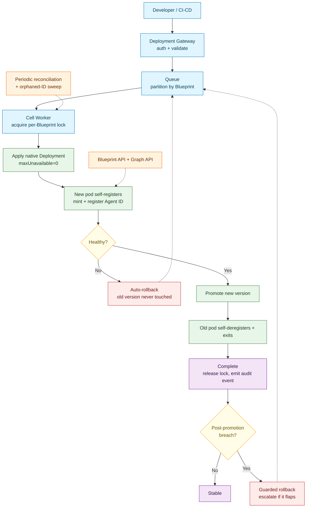

# UBS Agent Deployment Platform — The Problem and Our Solution

A plain-English walkthrough of what we're solving and how our architecture
solves it.

---

## Part 1 — The Problem

### The setting

At UBS, teams build AI agents and run them on UK8s (the internal Kubernetes
platform). The way things are organized:

- Every intern or team gets a **namespace** — their own walled-off area.
- Inside a namespace there are one or more **blueprints**. Think of a
  blueprint as the stable *identity* of an agent — for example, "the stock
  market research agent."
- Each blueprint has exactly **one live agent at a time**. But that agent
  keeps evolving. Version 1 might only do technical analysis; version 2 adds
  fundamental analysis; and so on.
- Here's the twist that makes this hard: **every new version gets a brand
  new Agent ID**, issued by an internal system called the Graph API. So v1
  isn't "the same agent, updated" — it's Agent ID 123. v2 is a *different*
  identity, Agent ID 362. The blueprint just points at whichever ID is
  currently the live one.

### What we actually need to happen

When a developer ships a new version, we need this exact sequence:

1. The new version gets deployed **alongside** the old one — the old one must
   keep serving the whole time.
2. Only once the new version is proven healthy do we switch the blueprint to
   point at it.
3. Only *after* that switch do we remove the old version and retire its
   Agent ID.

And the golden rule threaded through all of it:

> **Never take down a working version for a broken one.** If the new version
> fails, the old one must keep running as if nothing happened.

### Why this is genuinely hard

It sounds simple, but every step can fail in a way that could hurt
production:

- What if the new version deploys but never becomes healthy?
- What if we switch the blueprint over, but then deleting the old version
  fails halfway?
- What if two deployments for the same agent happen at the same time and
  fight each other?
- What if the process coordinating all this crashes in the middle?
- What if the systems that hand out Agent IDs or track blueprints time out?

A design is only acceptable if it has a clear, safe answer to *every one* of
those. That's the real problem: not "deploy a new version," but "deploy a
new version safely, at bank scale, without ever risking the version that's
already working."

---

## Part 2 — The Solution

### The core idea in one sentence

**Let each agent manage its own lifecycle from inside, and let Kubernetes'
own built-in behavior guarantee the old version never dies before the new
one is ready — with a lightweight, durable control plane sitting on top to
orchestrate, serialize, and audit everything.**

We deliberately avoided two heavy things other designs reached for: a
**custom Kubernetes resource type (CRD)** that developers would have to learn
and maintain, and a **complex idempotency database**. Instead we lean on
things Kubernetes already does well.

### The architecture at a glance



### Walking through it, step by step

**1. A developer ships a new version.**
It goes through the **Deployment Gateway**, which checks who's asking, that
the request is well-formed, and that the container image is properly signed.
Nothing touches production yet.

**2. The request lands in a queue, organized by blueprint.**
This is how we handle scale safely. Requests are grouped by blueprint, and
we allow **only one deployment at a time per blueprint** — so two updates to
the same agent can never collide — while letting *different* agents deploy
completely in parallel. A thousand different agents can update at once; the
same agent updates one at a time.

**3. A worker picks it up and acquires the blueprint's lock.**
The lock is what enforces "one at a time per blueprint." If another
deployment for this blueprint is already in flight, this one politely waits
its turn.

**4. The worker applies a plain, ordinary Kubernetes Deployment.**
This is a key simplicity choice. No custom resource, no special object —
just a normal Deployment, the kind every Kubernetes user already knows. It's
configured with one important setting: `maxUnavailable: 0`. In plain terms,
that tells Kubernetes: *"never take away the old version's capacity until the
new one is fully up and healthy."* This single native setting is what
guarantees our golden rule, and we didn't have to write any code to enforce
it — Kubernetes does it for us.

**5. The new agent registers itself.**
This is the heart of the design. When the new pod starts, a small
supervisor process inside it does three things, in order: it asks the Graph
API for a fresh Agent ID, it registers that ID against the blueprint, and
*only then* does it report itself as healthy. Until registration succeeds,
Kubernetes considers the pod "not ready" and sends it zero traffic. The
agent, in effect, checks itself in before it's allowed to open for business.

Notice what this avoids: the control plane never has to reach into the
cluster and hold the agent's credentials to register it. The agent does its
own paperwork.

**6. Is it healthy?**

- **If yes** → the new version is promoted (it already registered itself as
  current), and the old pod is retired. As the old pod shuts down, *it*
  checks itself out — its own supervisor deregisters its Agent ID before it
  exits. Deployment complete, lock released, an audit event recorded.

- **If no** → **automatic rollback.** And here's the beautiful part: because
  the old version was never taken down (`maxUnavailable: 0` made sure of
  that), "rolling back" just means deleting the broken new version. There's
  nothing to restore, nothing to repair — the old version has been serving
  the entire time and simply continues. Recovery takes seconds and needs no
  human.

**7. Watching for trouble after promotion.**
There's one sneaky failure mode: a version that passes all its health checks,
goes live, and *then* starts misbehaving in real production. We watch for
that during a short window after promotion. If it happens, we automatically
roll back to the previous good version — but with a guardrail: if rollbacks
start ping-ponging (which usually means the real problem is something
shared, not the agent itself), we stop and page a human instead of looping
forever.

**8. A safety net running quietly in the background.**
A periodic reconciliation sweep double-checks reality: it looks for any Agent
IDs that got created but left dangling (for example, if a pod crashed at
exactly the wrong moment while registering). It flags them so they can be
cleaned up. This is our honest safety net for the one edge case we chose not
to solve with heavy machinery.

---

## Part 3 — Why this design is good

**It's simple where it can be.** Every agent is a plain Kubernetes
Deployment. Developers don't learn a new object type. There's no custom
controller running that could crash and block everything.

**The safety guarantee comes from Kubernetes, not from us.** The most
important promise — "never kill a working version for a broken one" — is
enforced by a native, battle-tested Kubernetes setting, not by code we have
to write, test, and keep bug-free.

**The agent manages its own identity.** By having the pod register and
deregister itself, we keep credentials and cluster-write access out of the
central system, which shrinks the blast radius if anything is ever
compromised.

**It's fast.** Registration happens inside the pod's own startup, gated
directly by its health check — there's no slow external loop waiting to
notice and react.

**It scales cleanly.** Different agents are completely independent. Adding
the thousandth agent doesn't affect the other nine hundred and ninety-nine.

**Failed deploys fix themselves.** Automatic rollback means a bad push
recovers in seconds, on its own, with a human only involved to break a rare
loop.

### The one trade-off we're honest about

We chose not to build a heavy idempotency database. The cost: if a pod
crashes at the precise moment between getting an Agent ID and registering
it, it can leave one orphaned Agent ID behind. This never breaks the running
system — the agent that ends up serving is always correct — it's just a
small bit of leftover bookkeeping. Our background sweep detects and cleans
these up. We considered this a fair trade: far less complexity, in exchange
for a rare, harmless, and automatically-detected loose end.

---

## In one breath

A developer ships a new version → it's validated and queued per blueprint →
a worker deploys it as a plain Kubernetes Deployment while the old version
keeps serving → the new agent registers itself and proves it's healthy → if
healthy, it's promoted and the old one retires itself; if not, it rolls back
automatically with nothing lost → and a quiet background sweep keeps
everything tidy. Simple, safe, and fast, by leaning on what Kubernetes
already does well.
```